# CIS 561 Advanced Rendering Study Guide 

For best viewing
- clone repo 
- open vs code 
- install extension *Markdown All In One* by Yu Zhang
- `cmd + shift + v` to see md formatted

# Ray Tracing 
- Raycasting 
  - Cast a ray (line) from the camera eye to a screen pixel 
  - Find the first object the ray hits (intersection) and use that object's material info to get color for pixel 
- Shadows 
  - To compute shadows, cast a ray from the intersection to the light source. If the ray hits something to the light then, `color = black` otherwise `color = material_at_intersection`. 
- Everything is computed in `world space`

# Ray-Poly Intersection
- We test a ray against **untransformed** geometry.
- The model matrix of a polygon is the `local2world` matrix.
1. Transform the ray into local space. `primitive.world2local * ray_world` where `primitive.world2local = inv(local2world)`.
2. Do intersection test
    - Sub the ray equation into the primitive equation, rearrange and solve for `t`
    - We may have multiple `t` values
      - We take the largest `t` 
      - `t > 0` : valid t, ray intersects polygon in front of ray origin 
      - `t < 0` : ray intersects polygon behind the ray origin
      - `t = 0` : ray intersects polygon exactly at ray origin 
    - 
3. Transform intersection point `p` to world. `p_world = local2world * vec4(p,0)`. We also transform local surface normal. The `t` remains the same, explained below.

# Frames of Reference + Surface Normals
- After finding intersection, the `t_local` is the same as the `t_world` since the distance from the local ray to the sphere is the same as the skewed world ray to the world sphere 
- We also need the surface normal at the point of intersection, thus, we need to:
  - Get the surface `normal_local` from the intersection (e.g. unit sphere)
  - Problem: bringing normal to world, we can not simply do `local2world * local_normal` since that skews the normal to be not perpendicular because the scale of the `local2world` is applied to the normal vector 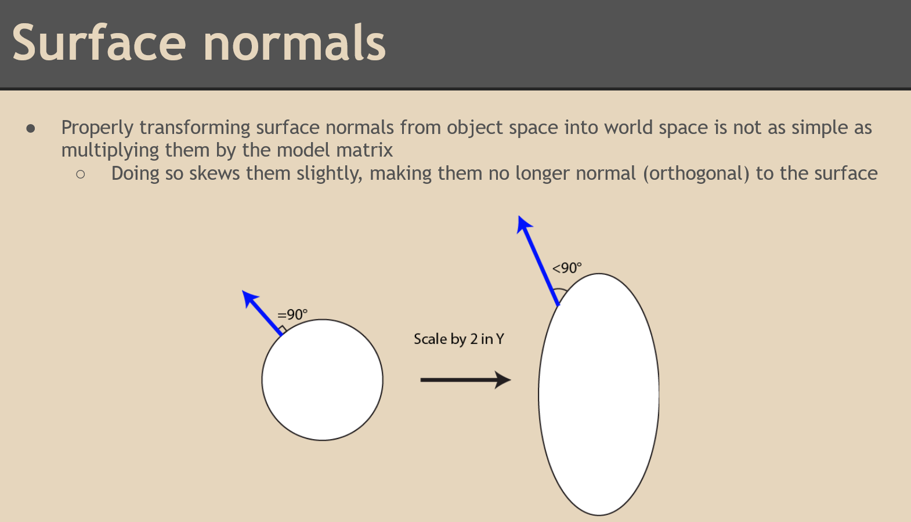
  - Solution: 
    - Invert the scale that is applied while keeping the rotation. Ignore translation because a normal has no position. 
    - `norm_world = inverse_transpose_local2world * norm_local`
    - The rotation matrix is preserved in the inverse transpose of the model matrix. 
- Homogenous coordinate transforms
  - If a point -> append 0 at the end `[a,b,c]` -> `[a,b,c,0]`
  - If a vector -> append 1 #finish me

# Sampling 
- We will randomly sample for $w_i$
- Continuous Random Variable (CRV) = a random variable that takes a infinite number of possible values 
- $\xi = [0,1)$
- Use a pair of uniform random variables as points on a unit 2D square, map 3D surface to 2D planes
- Types of sampling 
   - Pure random 
     - pro: Mathematically correct
     - con: Poor convergence rate 
     - con: Grainy ass shadows 
     - con: Samples may cluster by chance 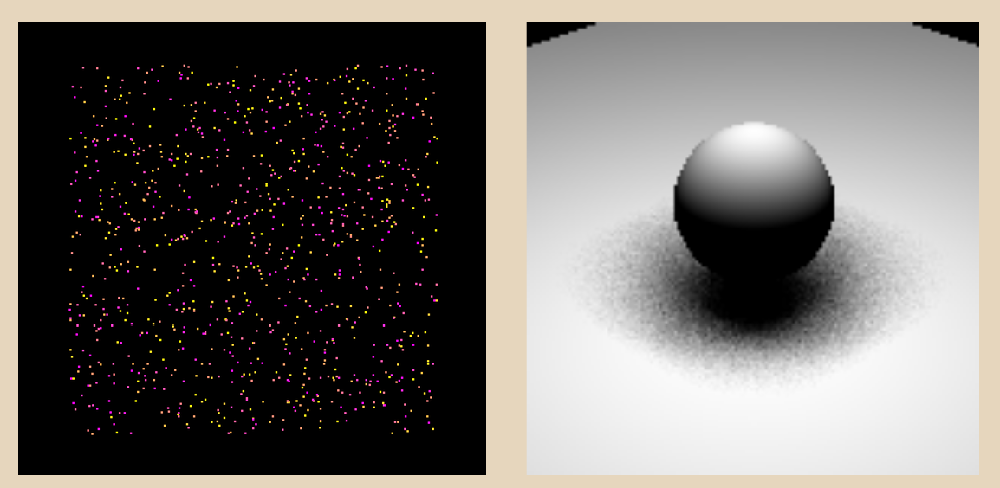
   - Grid 
     - divide square into grid cells, sample at grid middle
     - pro: uniform distribution 
     - con: looks too uniform to be natural, also line artifacts 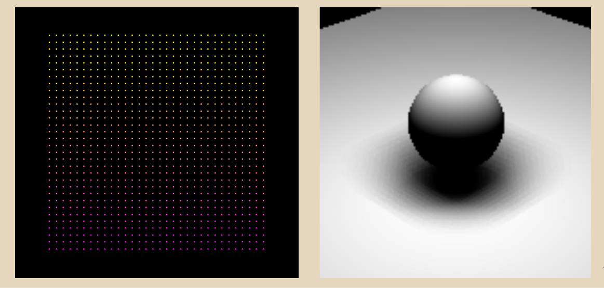
   - Stratified
     - combine grid and random approach by dividing square into grid cells and randomly sampling within the cell
     - shadow is uniform and no obvious artifacts 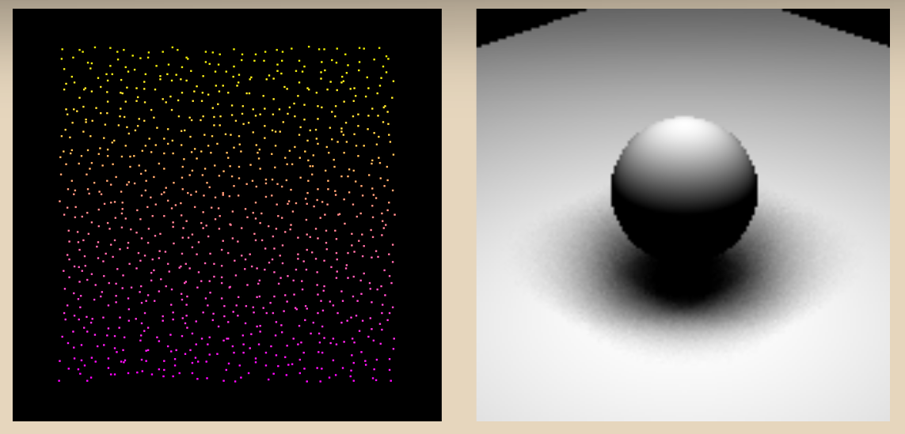
  
# Sample Warping 
Goal: want to map 2D points to 3D surfaces while maintaining relative spacing
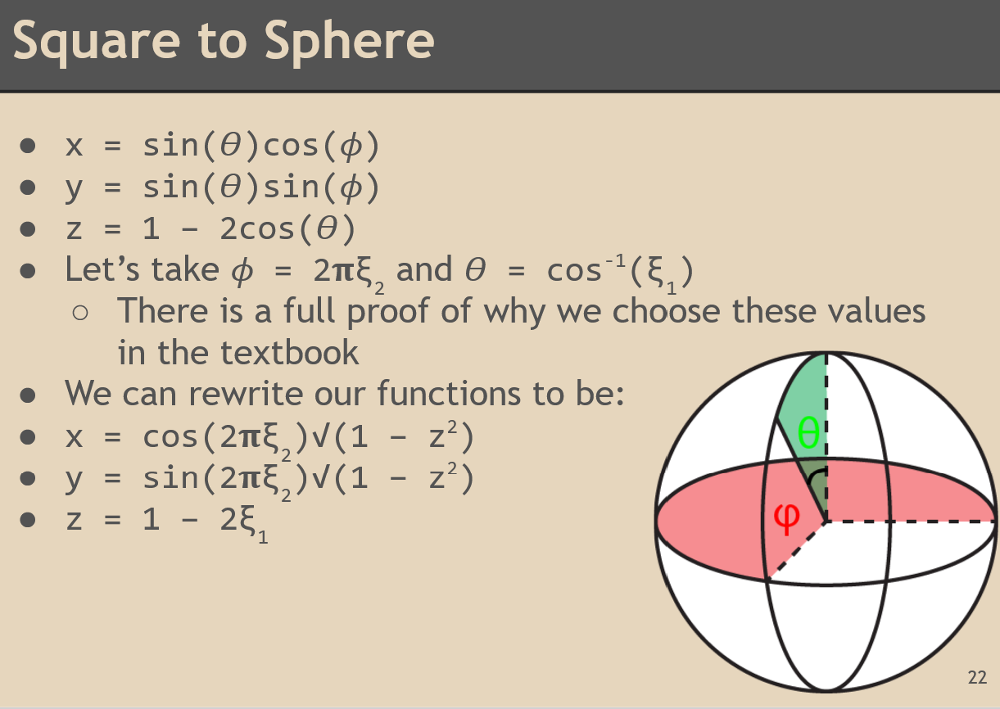

Types of Wrapping:
- Square to hemisphere uniform 
- Square to hemisphere weighted 
- Square to hemisphere cos-weighted 

Cos-weighted Sampling 
- What: bias samples towards the pole of the hemisphere so that each sample has more meaningful contribution (non-zero due to Lamber's law of cos in the LTE) in the LTE
- The greater the cosine angle between sample and surface normal, the more likely the sample is to be chosen. 
  - Highest prob: normal and sample are the same 
  - Lowest prob: normal and sample are perpendicular
- **Malley's Method**
  - A way to achieve cos weighted effect via 
  - Two equal sized areas on a disk when projected to hemisphere are not equal. The one closer to the hemisphere edge is projected as much larger. 
  - Points closer to the edge are more spread out, points closer to the center of the disk are clustered 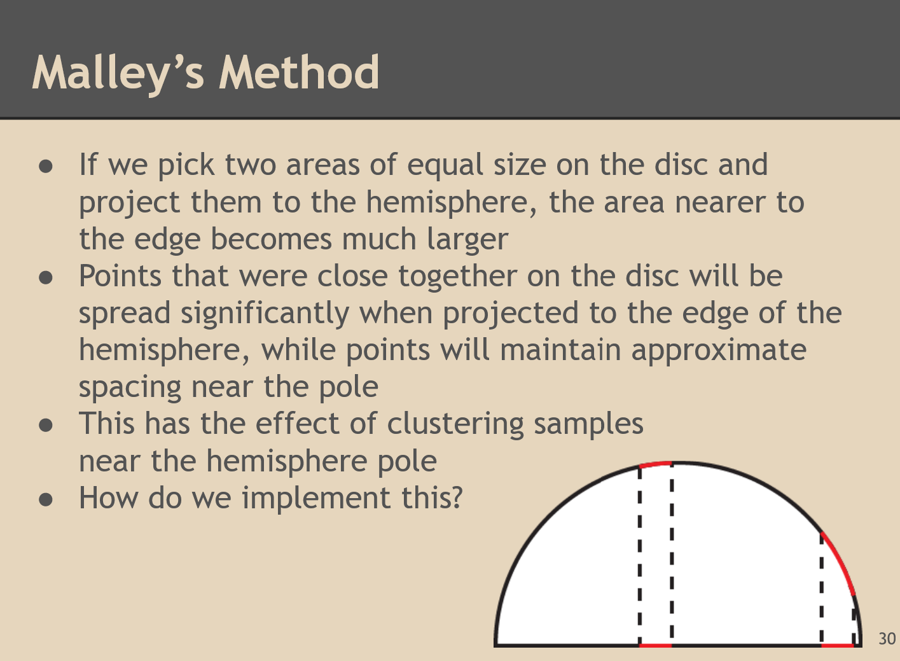
  - Can only do this by sampling a disk
- Square to Disk sampling 
  - Problem: 
    - we can not just do $\theta = \xi_1, r = 2\pi\xi_2$ because this ends up clustering samples near the center of the disc.
    - Arc lengths are smaller between angles at smaller r than at larger r. 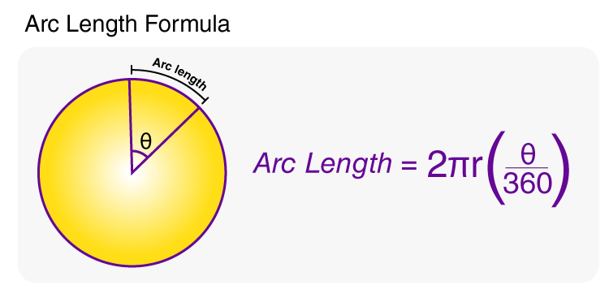
  - Solution: 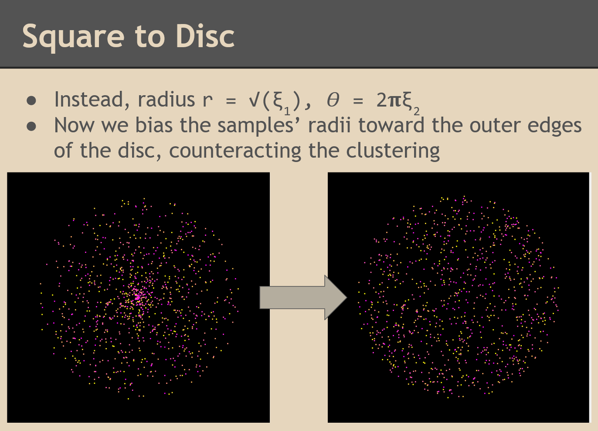

# Probability Distribution Functions (PDFs)
- Used to describe continuous probability -- infinite trials, infinite rolls 
- Integrated over the the whole infinite domain = 0 (cause $\int_{-inf}^{+inf} = 1$)
- The relative prob of any singular outcome = 0 (cause $\int_x^x = 0$)
- Why do we care? 
  - Cause `pdf(wi)` is used in LTE

# Light Transport Equation Summation (LTE)
$L_o(p,w) = L_E(p,w_o) + \Sigma\big(\frac{f(p, w_o, w_i) L_i(p,w_i)V(p',p)|dot(w_i, N)|}{pdf(w_i)}\big)$

In a path tracer, we trace the ray backwards i.e. we are casting rays from the camera to the scene and then sampling at the intersection to see how the ray bounced to determine the next ray direction. 

- $p$ = point of intersection 
- $N$ = the surface normal at p
- $w_o$ = ray out from camera/viewpoint to intersection (viewpoint - p)
- $w_i$ = ray in that is bounced from ray out; we usually sample this
- $p'$ = point in the scene that ray in hits when ray casted via origin point p 
- $L_o$ = radiance (light at) point p given the light ray coming "in" is $w_o$
  - This is the thing we are trying to compute.
- $L_E$ = the innate emitted radiance from point p.
  -  This is the natural light energy originating from the point that is not coming from reflected light. 
  -  This is only non-zero if the intersection is a light / the material "glows" (which also makes it a light lmao). 
  -  Returns a vec3 color
- $f(p, w_o, w_i)$ = the BRDF (bidirectional reflectance distribution function) at point p.
  - At point p, given $w_o$, and $w_i$ the material returns what color
  - When implementing this function usually determines $w_i$ since the bounce ray is correlated with properties of the material 
  - Returns a vec3 color 
- $L_i(p,w_i)$ = radiance at point p in the direction $w_i$
  - The light energy coming from $w_i$ direction
  - Returns a vec3 color
- |dot(w_i, N)| = Lambert's cosine law
  - The measure of radiant energy from surface at p that exhibits Lambertian reflection is directly proportional to the cosine of the surface normal and the incident light ray 
  - cos(0) = 1 when $w_i$ and $N$ the same
  - cos(90) = 0 when  $w_i$ and $N$ are perpendicular 
  - Returns a multiplier [0,1]
- $pdf(w_i)$ = probability density function associated with the sampling function 
  - when we sample $w_i$, we

# Monte Carlo Path Tracing  
- Monte Carlo estimation computes the expected value of the LTE 
  - takes random samples of a function and averages out the results together
  - the more samples = the more correct the average result of the correct integral value 

# BRDFs
- A function 
  - Input: energy along `wo`, intersection `p`, direction of incoming light `wi`
  - Output: light energy (vec3) along `wo` at `p` given light coming in from `wi` direction
- Directly dependent on material attributes 
- Examples: 
  - Lambert: 
    - Illumination over the hemisphere is uniform 
    - All directions within the hemisphere emit the same energy 
    - So function is a constant, `mat_color / pi`
    - Why div pi? Cause we need to integrate over the hemisphere surface area. 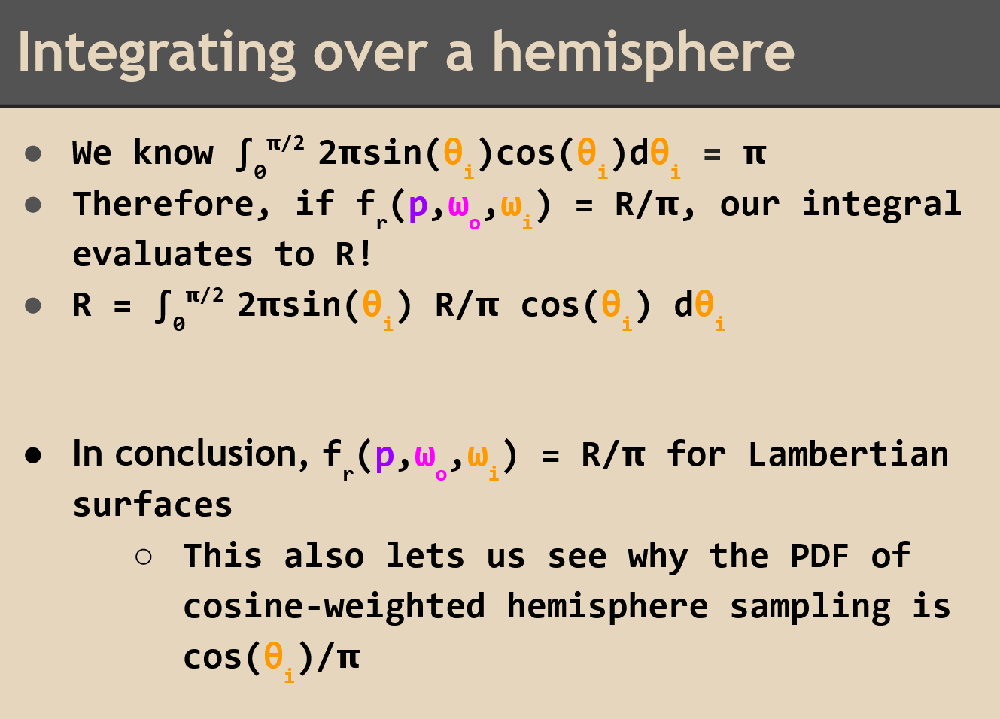
  - Specular/Mirror: a function that is 0/black for all `wi` and `wo` that are not perfect reflections of one another at `p`, and 1 when `wi = reflect(wo)`
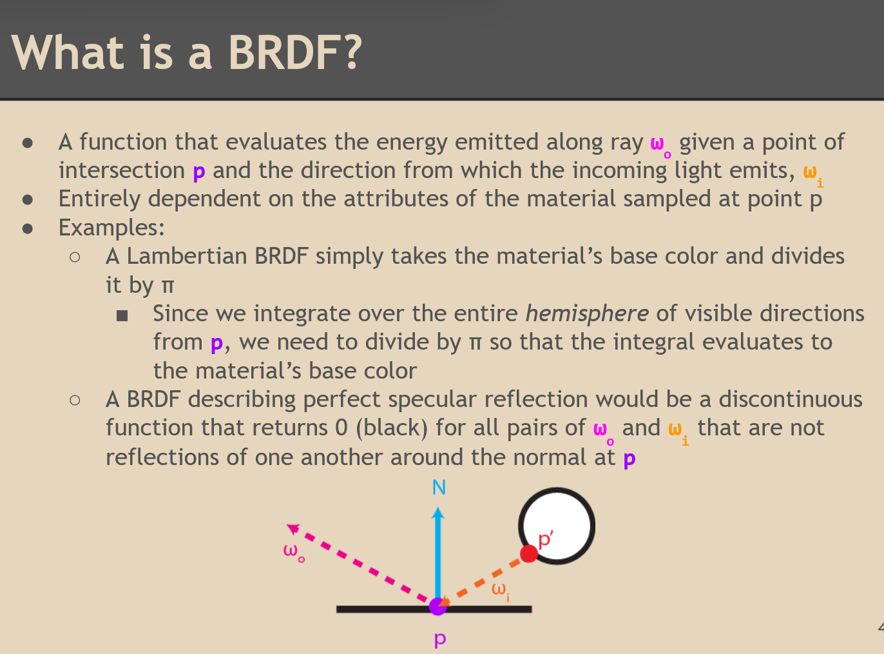

# Specular & Transmissive Materials 
- Fresnel 
- Transmission + Reflectance 
- fuck 

# Naive Path Tracer 
- Cast rays and sample from the intersection BRDF. 
- Ray terminates at recursion depth. 
- Ray only returns non-black if it hits the light at some point in the path. 
- Image converges very slowly. 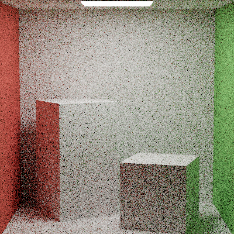

# Direct Lighting 
- Light source sampling, every sample returns information
- For each sample, cast $w_i$ directly at the light sources
### Sampling Light Sources 
- Types
  - Point light = just 1 $w_i$
  - Area light, env light = infinitely many destinations for $w_i$  
- Area Light Sampling, getting $w_i$
  - Randomly sample a point on the light's surface 
  - Depends on the shape of the light, can use any type of sampling (uniform disk, random square, random sphere, etc)
  - `wi` is just sampled like that 
- Area Light Sampling, getting $pdf(w_i)$ 
  - Find pdf wrt to light. $PDF_{light} = \frac{1}{area}$
  - Where light area is the surface area of the light 
  - Convert $PDF_{light}$ to $PDF_{solid\_angle}$
### Solid Angle Conversion 
**$PDF{dw} = PDF_{dA} * (r^2/cos(\theta)) = r^2 / (cos(\theta) * area)$**
  - **All pdfs** in the path tracer are **with respect to the domain of the hemisphere**, thus we need to convert the PDF wrt light surface area to pdf wrt hemisphere solid angle 
  - 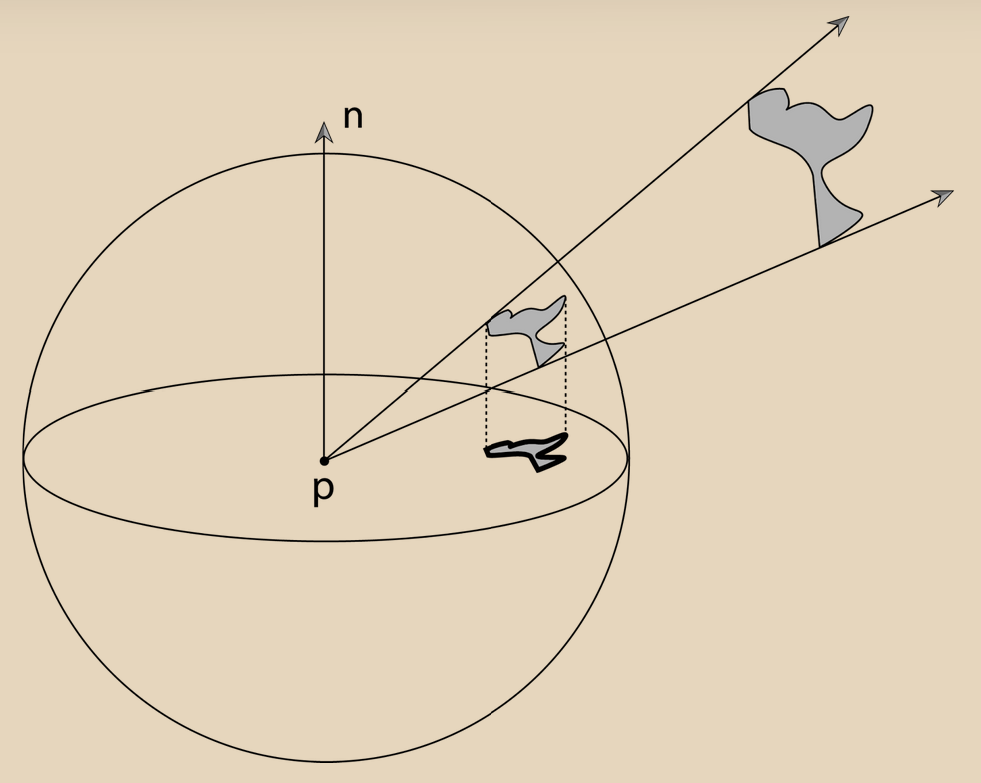
  - 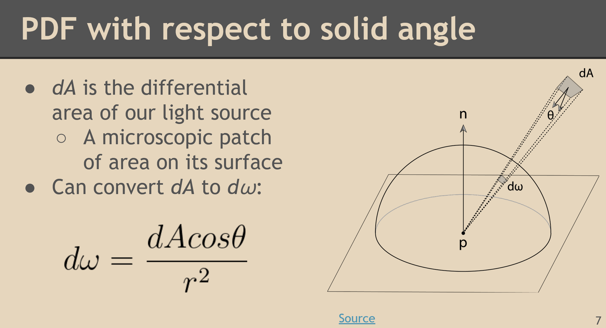
  - 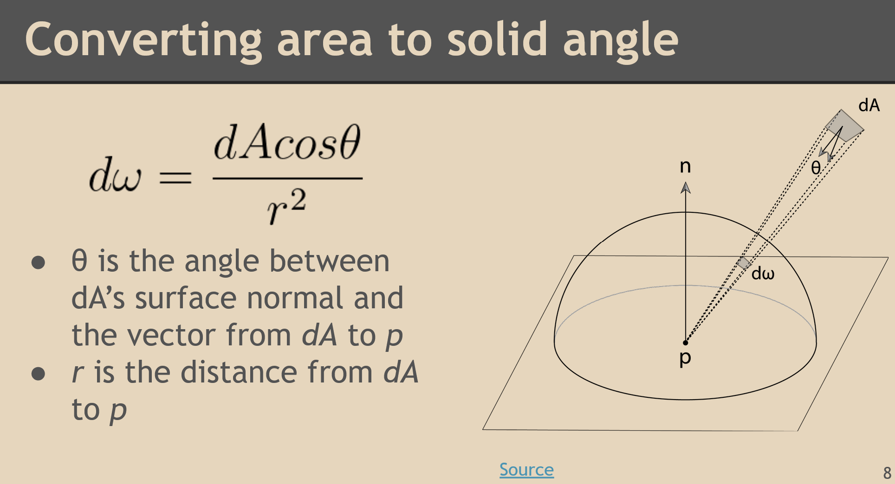
  - Solid angle's $dw$ intuition:
    - $1 / r^2$ : the farther you (intersection point p) is from the light, the smaller the light path looks
    - $cos(\theta)$ : theta is the angle between the `light normal` and the `norm(p - light)`
      - Smaller theta, larger cos(theta) = the more directly the light shines on p 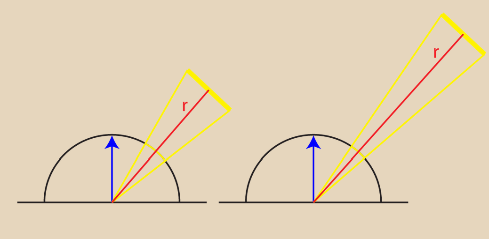
      - Larger theta, smaller cos(theta) = the more the light faces away from p 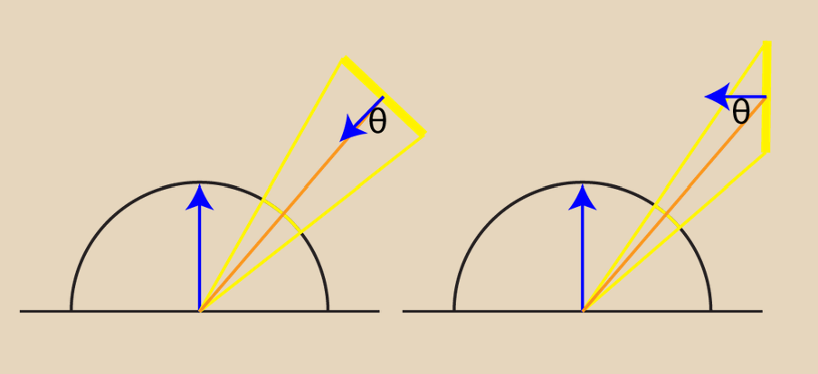
  - Conversion: 
    - $dw/dA = cos(\theta) / r^2$
    - $PDF_{dw} = PDF_{dA} / (dw/dA)$

# Gamma Correction 
- Problem: our eye balls do not perceive light the way cameras do. 
- Digital cameras capture a `linear relationship` in luminance, but our eyes don't follow this. 
- Our eyes are more sensitive to changes in dark tones than it is in bright tones. 
- We gamma correct via the `Power Law` 
  - $V_{correct} = V_{linear}^{\gamma}$
  - $\gamma = 1$ = original image
  - $\gamma > 1$ = darker shadows 
  - $\gamma < 1$ = lighter shadows 
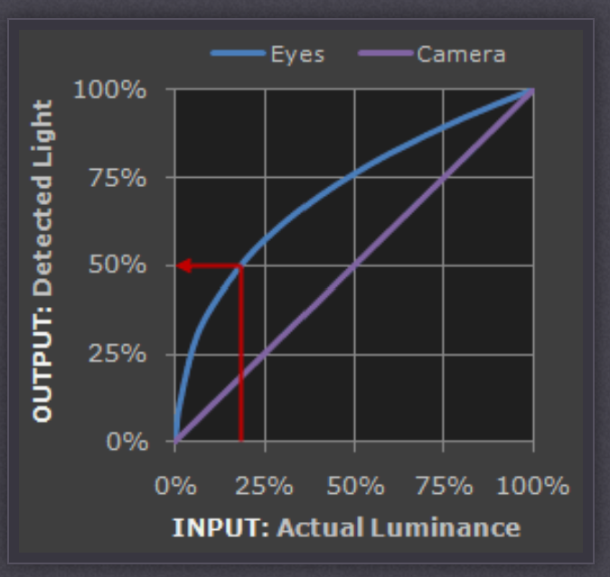 

# Multiple Importance Sampling 
- `Left` = BSDF sampling; `Right` = light sampling 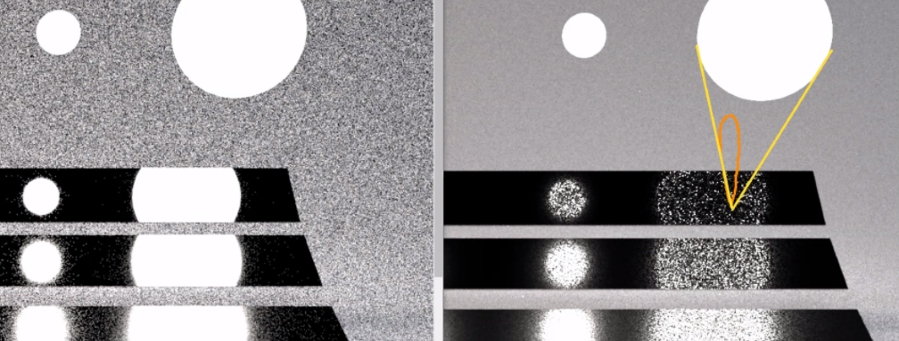
  - Orange lobe = bsdf, the more scattered (less specular, less mirror-like), the larger the lobe 
  - Yellow cone = light distribution 
- Variance 
- The Balance Heuristic 
  - The sampling #finish me

# Implicit vs Explicit Surfaces 
- Explicit surfaces = defined by *parameterization* functions, e.g. meshes or specific shapes. 
  - circle: f(t) = {r * cos(t), r * sin(t)}
- Implicit surfaces = set of all solutions to some function F(x,y,z) = 0, where x, y, z are unsolved.
  - circle: F(x,y) = sqrt(x*x + y * y) - r 
  - when we plug in x, y and get a 0, then we get some point on the circle
- Implicit surfaces are more flexible (any F where solutions exist) 

# Ray Tracing vs Ray Marching 
 
- Finding an explicit surface: Ray-Tracing 
  - Given a ray and a specific shape, use that shape's specific intersection test to determine whether the ray intersects it and if so, where.
  - With a ray tracer, we can just plug in point on ray and point on surface, rearrange and we can solve for t 
  - Limitations: we can only solve for a position on the surface (sometimes we don't want to do that / do more)
  
- Finding an implicit surface: Ray Marching
  - Given a ray and implicit surface function F(x,y,z), test points along the ray to see if they solve for F = 0. 
  - We are repeatedly going to plug in our point on ray into our point on surface function, and if it gives us back ~0, then we have found a point on surface that is roughly 0. 
  - Basically, we take some $\delta$ step from the camera and check at every step
  - Problem: if we just guess and check like this, then it is not efficient 

# Signed Distance Fields (SDFs) of Implicit Surfaces 
- SDF
  - takes a point 
  - returns min distance to implicit shape's surface
- SDF(point) evaluates to 
  - `0`, when on the surface 
  - `>0` when outside 
  - `<0` when inside
- SDF must be linear

# Better marching for SDF: Sphere-Marching 
- Problem: in Ray marching, $\delta$ increments must be fixed, but this causes us to over or undershoot. Resolve this with Sphere marching using SDF 
- Since we know the distance to any SDF, if the ray marches the distance closest to SDF, then it will never overshoot anything.
- Sphere marching allows us to take big, variable steps instead of small uniform ones 
- How does sphere marching work?
  - Start at camera origin p
  - Plug in p to the SDF, so SDF(p) = d where d is the minimum surface to surface. d is a length!
  - Update march point with d, so p = p + d * ray_dir 
  - This way we never over shoot 
- Sphere march termination condition variations
  1. We hit our surface SDF(p) = 0 + $\epsilon$
  2. We traveled some max dist along our ray
       - con: we don't see a surface that is just beyond the max 
  3. We've iterated some max number of iters along our ray 
       - con: our ray can travel very near the surface for a long time, waisting steps 
- 
- Warping shapes via SDFs 
  - Add an offset to the SDFs 
- Benefits of SDFs 
  - Ambient occlusion is cheap = if something takes a lot of iterations, then it is probably close to a object so you can make it darker 
  - Smooth blending: combine SDFs together to make cool shapes #ask 
    - Like a peanut
  - Nice Penumbra shadows 
    - Easily approximate a penumbra 
    -  to see if a point in the scene can "see" the light source by marching a ray from the point in the direction of light 
    - If you hit an object before you reach the light, you're in shadow
  - Infinite repetition without storing any of the geometry
    - possible by grid bounding and moving the ray position as you grid march
  - Subsurface scattering 
- Approximate surface normal using SDF
  - Surface normal is just change in distance of SDF (similar to slope = y1 - y2 in linear space)
  - Look a small distance along the x, y, z axis from point of intersection 
  - So create p'.coord = p.coord + $\epsilon$ for every coordinate of the normal
  - N = normal(SDF(p') - SDF(p))

# Ray Marching 

# Micro-facet Materials 
- Ornayar Model 
    - Is a micro-facet material that decreases the fall off of a standard Lambertian model such that is looks more physically accurate

# Volumemetric 

# Anti-Aliasing
- Cast multiple rays at different locations in a pixel
- In a path tracer, we super sample the data behind the pixel and average the colors together. 

# Soft Shadows 
- What prevents soft shadows? 
  - When lights only have one `w_i` no matter the `w_o` or position e.g. pont lights, directional lights
  - 
- What makes soft shadows?
  - When the light source has surface area and is made partially available to a point
- How to sample soft shadows?
  - Treat a diffuse area light as a collection of point lights
  - Basically, for a pixel we sample the hemisphere of view directions, some directions will be blocked and some will not be blocked, thus the average of all those directions will give us varying darkness. 

# Depth of Field 
- Only happens with a thin lens camera - aperture is no longer a single point in space 
- #finish me 

# Quiz Review 
# Naive Integrator 
- Why is anti-aliasing free in MCPT?
  - We are super sampling the space under the pixel (casting multiple rays starting at different points in a pixel). The different ray directions is the jitter, which allows us to get a color average behind a pixel. 
- Why is cos weighted sampling always better? 
  - Because we get more samples near the pole and less at the equator 
  - Because of Lamber's law of cos, samples at the poles will contribute more. Light gets more diffuse the more perpendicular, so the `abscos(wi, N)` term goes to `0`, so the equator rays will give `0` energy.
  - **Lambert law of cos is an attribute of light, not material**, so it always applies.
# todo
# Global Illumination 
- Because we do light sampling and BRDF sampling, the light sampling guarantees at every pixel we get some color so the image converges more quickly.
- We boost the non-terminated rays in Russian Roulette in order to counter act the fact that we killed many rays. 
- We do not use the BSDF-sampled ray direction from multiple importance sampling as both the MIS sample and the GI sample because we want the following to be mutually exclusive: if a ray hits a light it can only contribute via MIS, if it hits non-light it can only contribute GI, so a ray can not be both. This we need to sample BSDF twice, once for MIS and once for GI. 

